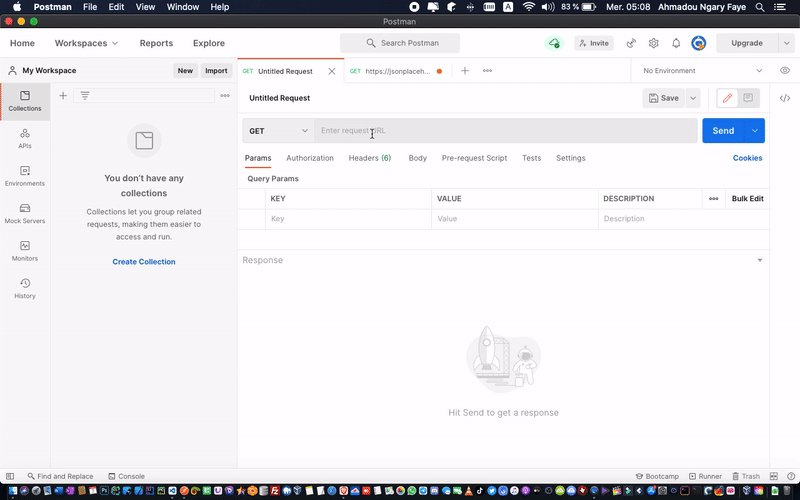

<span style="font-size:24px; font-weight:bold"> Backend & REST API [Node JS - Express - Mongodb Atlas] <span style="font-size:11px; font-style:italic"> - by ng_xcv 😁 </span></span>

<span style="font-size:24px; font-weight:bold"> Backend & REST API [Node JS - Express - Mongodb Atlas] <span style="font-size:11px; font-style:italic"> - by ng_xcv 😁 </span></span>

<a href="http://ngxcv.com" title="Visiter mon site web" target="_blank"  ></a>
<br/>
<br/>
Il s'agit la d'une application basique Backend & Rest Api avec Express JS et Mongodb Atlas. <br />
Elle traite l'ajout et l'affichage d'utilisateur dans une base donnée MongoDb.

<br />

#### Installation

```js
npm install
```

#### Démarrer le projet

```js
npm start
```

---

### Paquets Installés

<br />

Express

```js
npm install Express
```

<br />
Recharger automatiquement le server

```json
npm install nodemon

Ajouter la cette ligne dans le fichier package.json file => "start" : "nodemon app.js"

"scripts": {
    "test": "echo \"Error: no test specified\" && exit 1",
    "start": "nodemon app.js"
  },
```

<br />

Extension REST Client permet d'envoyer des requêtes HTTP et de visualiser la réponse directement dans Visual Studio Code.

```html
# Créer un fichier avec comme extension .http Requête : GET
http://localhost:3000/users
```

<br />

Base de donnée : Mongoose est un outil de modélisation d'objets MongoDB <br />

URI : [Chaine de connexion](http://docs.mongodb.org/manual/reference/connection-string/)

```js
npm install mongoose
```

<br />

Dotenv est un module sans dépendance qui charge les variables d'environnement d'un fichier .env dans process.env

```js
npm install dotenv
```

<br />

---

### Test avec Postman



<br/>
<br/>

Merci à  
 <a href="https://www.youtube.com/channel/UCFTM1FGjZSkoSPDZgtbp7hA">
Mtechviral
</a>
